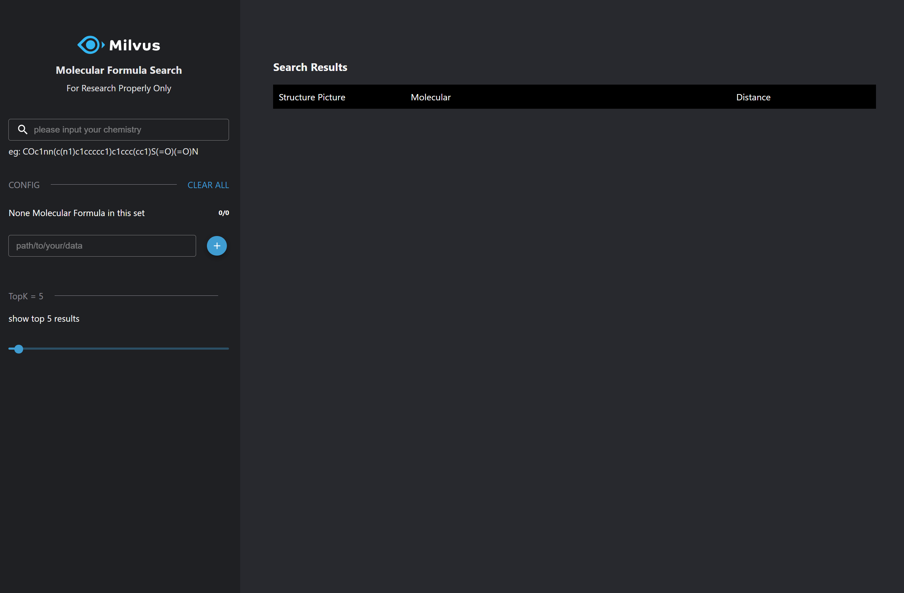

#### 4. Launch a browser

Click `+` to the right of the `Terminal`, then View HTTP port 80 on Host 1 to show the interface.

## How to use
- Initial interface

- Load chemical structures
  1. In `path/to/your/data`, enter the location of the smi file. For example, `/tmp/data/test_1w.smi`.
  2. Click `+` to load.
  3. You can see the number of chemical structures have changed: 10000 Molecular Formula in this set

- Search chemical structures
  1. Enter the chemical structure to search, such as `Cc1ccc(cc1)S(=O)(=O)N`, and press `ENTER`.
  2. Set the value of topk. This demo returns topk most similar chemical structures.

- Clear chemical structure data

  Click `CLEAR ALL` to remove all chemical structure data.